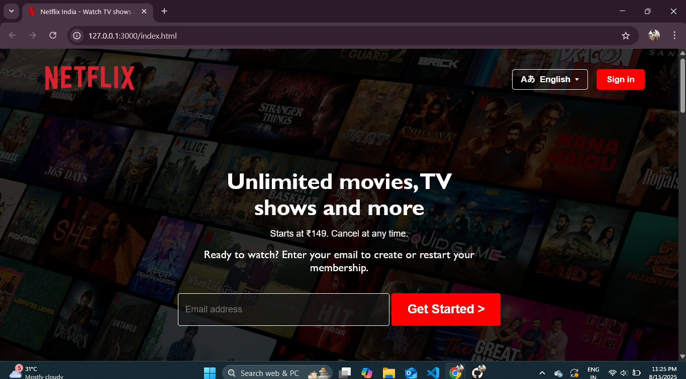

# Netflix Clone 🎬

This is my first major front-end project: a clone of the Netflix homepage, built entirely with **HTML** and **CSS**.
The goal was to replicate the look and feel of the Netflix landing page as closely as possible,
focusing on the layout design.

**Live Demo:** https://github.com/shrmaxanmol/NetflixClone/
**Website Link:** https://shrmaxanmol.github.io/NetflixClone/

---

### Screenshot

---

### Features

* **Header & Navigation:** A clean and responsive navigation bar.
* **Hero Section:** The main "Unlimited movies, TV shows, and more" section.
* **Feature Sections:** Replicas of the "Enjoy on your TV," "Download your shows," etc., sections.
* **FAQ Section:** A fully functional accordion-style FAQ component.
* **Footer:** A multi-column footer with links, matching the original design.

---

### What I Learned

This project was a fantastic learning experience where I practiced:

* **Semantic HTML5:** Structuring the website for clarity and accessibility.
* **Advanced CSS:** Using **Flexbox** and **CSS Grid** to create complex, responsive layouts.
* **Responsive Design:** Using media queries to ensure the site looks great on all devices.
* **Attention to Detail:** Matching fonts, colors, and spacing to replicate a professional design.

---
